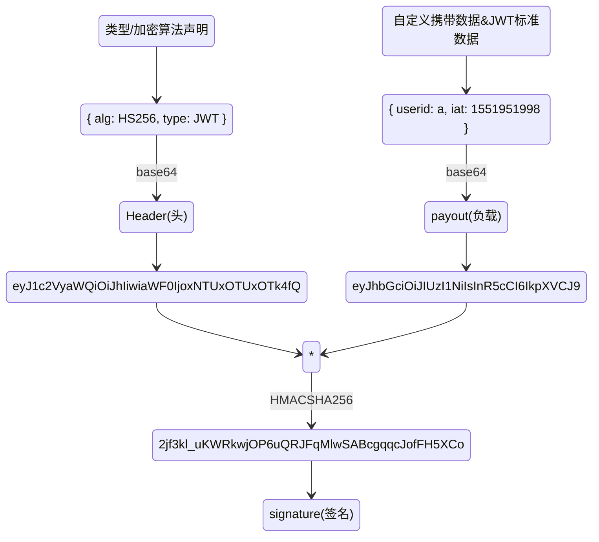

# Authentication

> 由于 HTTP 是无状态的协议（对于事务处理没有记忆能力，每次客户端和服务端会话完成时，服务端不会保存任何会话信息），每个请求都是完全独立的，服务端无法确认当前访问者的身份信息，无法分辨上一次的请求发送者和这一次的发送者是不是同一个人。所以服务器与浏览器为了进行会话跟踪（知道是谁在访问我），就必须主动的去维护一个状态，这个状态用于告知服务端前后两个请求是否来自同一浏览器。

## cookie

> cookie 是服务器发送到用户浏览器并保存在本地的一小块数据，它会在浏览器下次向同一服务器再发起请求时被携带并发送到服务器上。每个 cookie 都会绑定单一的域名，无法在别的域名下获取使用，一级域名和二级域名之间是允许共享使用的（靠的是 domain）。

| 属性 | 说明 |
| --- | --- |
| **name=value** | 键值对，设置 Cookie 的名称及相对应的值，都必须是**字符串类型**。如果值为 Unicode 字符，需要为字符编码。如果值为二进制数据，则需要使用 BASE64 编码。|
| **domain** | 指定 cookie 所属域名，如果没有指定该属性，浏览器会默认将其设为当前 URL 的一级域名 |
| **path** | 指定 cookie 在哪个路径（路由）下生效，默认是 '/'。如果设置为 `/abc`，则只有 `/abc` 下的路由可以访问到该 cookie，前提是域名必须一致。 |
| **maxAge** | cookie 失效的时间，单位秒。如果为整数，则该 cookie 在 maxAge 秒后失效。如果为负数，该 cookie 为临时 cookie ，关闭浏览器即失效，浏览器也不会以任何形式保存该 cookie 。如果为 0，表示删除该 cookie 。默认为 -1。**比 expires 好用**。|
| **expires** | 过期时间，在设置的某个时间点后该 cookie 就会失效。一般浏览器的 cookie 都是默认储存的，当关闭浏览器结束这个会话的时候，这个 cookie 也就会被删除 |
| **secure** | 指定浏览器只有在加密协议 HTTPS 下，才能将这个 Cookie 发送到服务器。如果当前协议是 HTTP，浏览器会自动忽略服务器发来的Secure属性。该属性只是一个开关，不需要指定值。如果通信是 HTTPS 协议，该开关自动打开。 |
| **httpOnly** | 如果给某个 cookie 设置了 httpOnly 属性，则无法通过 JS 脚本 读取到该 cookie 的信息，但还是能通过 Application 中手动修改 cookie，所以只是在一定程度上可以防止 XSS 攻击，不是绝对的安全 |

## Session

> session 是另一种记录服务器和客户端会话状态的机制，是基于 cookie 实现的，session 存储在服务器端，sessionId 会被存储到客户端的cookie 中。

**认证流程**

*   用户第一次请求服务器的时候，服务器根据用户提交的相关信息，创建对应的 Session
*   请求返回时将此 Session 的唯一标识信息 SessionID 返回给浏览器
*   浏览器接收到服务器返回的 SessionID 信息后，会将此信息存入到 Cookie 中，同时 Cookie 记录此 SessionID 属于哪个域名
*   当用户第二次访问服务器的时候，请求会自动判断此域名下是否存在 Cookie 信息，如果存在自动将 Cookie 信息也发送给服务端，服务端会从 Cookie 中获取 SessionID，再根据 SessionID 查找对应的 Session 信息，如果没有找到说明用户没有登录或者登录失效，如果找到 Session 证明用户已经登录可执行后面操作。

## Token

### Acesss Token

组成: 凭证/信息 (uid, time, sign)

**验证流程**

1.  客户端使用用户名跟密码请求登录
2.  服务端收到请求，去验证用户名与密码
3.  验证成功后，服务端会签发一个 token 并把这个 token 发送给客户端
4.  客户端收到 token 以后，会把它存储起来，比如放在 cookie 里或者 localStorage 里
5.  客户端每次向服务端请求资源的时候需要带着服务端签发的 token
6.  服务端收到请求，然后去验证客户端请求里面带着的 token ，如果验证成功，就向客户端返回请求的数据

### Refresh Token

专用于刷新 access token 的 token，当 Acesss Token 由于过期而失效时，使用 Refresh Token 就可以获取到新的 Token，如果 Refresh Token 也失效了，用户就只能重新登录了。Refresh Token 及过期时间是存储在服务器的数据库中，只有在申请新的 Acesss Token 时才会验证，不会对业务接口响应时间造成影响，也不需要向 Session 一样一直保持在内存中以应对大量的请求。

### Json Web Token

> JSON Web Token (JWT) 是一个开放标准，定义了一种传递 JSON 信息的方式。这些信息通过数字签名确保可信。

**相同**

*   都是访问资源的令牌
*   都可以记录用户的信息
*   都是使服务端无状态化
*   都是只有验证成功后，客户端才能访问服务端上受保护的资源

**区别**

*   Token：服务端验证客户端发送过来的 Token 时，还需要查询数据库获取用户信息，然后验证 Token 是否有效。
*   JWT： 将 Token 和 Payload 加密后存储于客户端，服务端只需要使用密钥解密进行校验（校验也是 JWT 自己实现的）即可，不需要查询或者减少查询数据库，因为 JWT 自包含了用户信息和加密的数据。

**使用**

1. 当用户希望访问一个受保护的路由或者资源的时候，可以把它放在 Cookie 里面自动发送，但是这样不能跨域，所以更好的做法是放在 HTTP 请求头信息的 Authorization 字段里，使用 Bearer 模式添加 JWT。
2. 跨域的时候，可以把 JWT 放在 POST 请求的数据体里。
3. 通过 URL 传输

## 区别

**cookie**

*   因为存储在客户端，容易被客户端篡改，使用前需要验证合法性
*   不要存储敏感数据，比如用户密码，账户余额
*   使用 httpOnly 在一定程度上提高安全性
*   尽量减少 cookie 的体积，能存储的数据量不能超过 4kb
*   设置正确的 domain 和 path，减少数据传输
*   **cookie 无法跨域**
*   一个浏览器针对一个网站最多存 20 个Cookie，浏览器一般只允许存放 300 个Cookie

**session**

*   将 session 存储在服务器里面，当用户同时在线量比较多时，这些 session 会占据较多的内存，需要在服务端定期的去清理过期的 session
*   当网站采用**集群部署**的时候，会遇到多台 web 服务器之间如何做 session 共享的问题。因为 session 是由单个服务器创建的，但是处理用户请求的服务器不一定是那个创建 session 的服务器，那么该服务器就无法拿到之前已经放入到 session 中的登录凭证之类的信息了。
*   当多个应用要共享 session 时，除了以上问题，还会遇到跨域问题，因为不同的应用可能部署的主机不一样，需要在各个应用做好 cookie 跨域的处理。
*   **sessionId 是存储在 cookie 中的，假如浏览器禁止 cookie 或不支持 cookie 怎么办？** 一般会把 sessionId 跟在 url 参数后面即重写 url，所以 session 不一定非得需要靠 cookie 实现

**token**

*   如果你认为用数据库来存储 token 会导致查询时间太长，可以选择放在内存当中。比如 redis 很适合你对 token 查询的需求。
*   **token 完全由应用管理，所以它可以避开同源策略**
*   **token 可以避免 CSRF 攻击(因为不需要 cookie 了)**
*   **移动端对 cookie 的支持不是很好，而 session 需要基于 cookie 实现，所以移动端常用的是 token**

**JWT**

*   因为 JWT 并不依赖 Cookie 的，所以你可以使用任何域名提供你的 API 服务而不需要担心跨域资源共享问题（CORS）
*   JWT 默认是不加密，但也是可以加密的。生成原始 Token 以后，可以用密钥再加密一次。
*   JWT 不加密的情况下，不能将秘密数据写入 JWT。
*   JWT 不仅可以用于认证，也可以用于交换信息。有效使用 JWT，可以降低服务器查询数据库的次数。
*   JWT 最大的优势是服务器不再需要存储 Session，使得服务器认证鉴权业务可以方便扩展。但这也是 JWT 最大的缺点：由于服务器不需要存储 Session 状态，因此使用过程中无法废弃某个 Token 或者更改 Token 的权限。也就是说一旦 JWT 签发了，到期之前就会始终有效，除非服务器部署额外的逻辑。
*   JWT 本身包含了认证信息，一旦泄露，任何人都可以获得该令牌的所有权限。为了减少盗用，JWT的有效期应该设置得比较短。对于一些比较重要的权限，使用时应该再次对用户进行认证。
*   JWT 适合一次性的命令认证，颁发一个有效期极短的 JWT，即使暴露了危险也很小，由于每次操作都会生成新的 JWT，因此也没必要保存 JWT，真正实现无状态。
*   为了减少盗用，JWT 不应该使用 HTTP 协议明码传输，要使用 HTTPS 协议传输。

::: tip

> 只要关闭浏览器 ，session 真的就消失了？

不对。对 session 来说，除非程序通知服务器删除一个 session，否则服务器会一直保留，程序一般都是在用户做 log off 的时候发个指令去删除 session。然而浏览器从来不会主动在关闭之前通知服务器它将要关闭，因此服务器根本不会有机会知道浏览器已经关闭，之所以会有这种错觉，是大部分 session 机制都使用会话 cookie 来保存 session id，而关闭浏览器后这个 session id 就消失了，再次连接服务器时也就无法找到原来的 session。如果服务器设置的 cookie 被保存在硬盘上，或者使用某种手段改写浏览器发出的 HTTP 请求头，把原来的 session id 发送给服务器，则再次打开浏览器仍然能够打开原来的 session。

恰恰是由于关闭浏览器不会导致 session 被删除，迫使服务器为 session 设置了一个失效时间，当距离客户端上一次使用 session 的时间超过这个失效时间时，服务器就认为客户端已经停止了活动，才会把 session 删除以节省存储空间。

:::

## 分布式架构下 session 共享方案

1. session 复制

> 任何一个服务器上的 session 发生改变（增删改），该节点会把这个 session 的所有内容序列化，然后广播给所有其它节点，不管其他服务器需不需要 session ，以此来保证 session 同步

优点： 可容错，各个服务器间 session 能够实时响应。
缺点： 会对网络负荷造成一定压力，如果 session 量大的话可能会造成网络堵塞，拖慢服务器性能。

2. 粘性 session /IP 绑定策略

> 采用 Ngnix 中的 ip_hash 机制，将某个 ip的所有请求都定向到同一台服务器上，即将用户与服务器绑定。 用户第一次请求时，负载均衡器将用户的请求转发到了 A 服务器上，如果负载均衡器设置了粘性 session 的话，那么用户以后的每次请求都会转发到 A 服务器上，相当于把用户和 A 服务器粘到了一块，这就是粘性 session 机制。

优点： 简单，不需要对 session 做任何处理。
缺点： 缺乏容错性，如果当前访问的服务器发生故障，用户被转移到第二个服务器上时，他的 session 信息都将失效。
适用场景： 发生故障对客户产生的影响较小；服务器发生故障是低概率事件。
实现方式： 以 Nginx 为例，在 upstream 模块配置 ip_hash 属性即可实现粘性 session。

3. session 共享（常用）

> 使用分布式缓存方案比如 Memcached 、Redis 来缓存 session，但是要求 Memcached 或 Redis 必须是集群

优点： 架构上变得复杂，并且需要多访问一次 Redis
缺点： 服务器重启 session 不丢失（不过也要注意 session 在 Redis 中的刷新/失效机制），不仅可以跨服务器 session 共享，甚至可以跨平台，可以水平扩展（增加 Redis 服务器）

4. session 持久化

> 将 session 存储到数据库中，保证 session 的持久化

优点： 服务器出现问题，session 不会丢失
缺点： 如果网站的访问量很大，把 session 存储到数据库中，会对数据库造成很大压力，还需要增加额外的开销维护数据库。

## 单点登陆

* “虚假”的单点登录（主域名相同）

> 简单的，如果业务系统都在同一主域名下

* “真实”的单点登录（主域名不同）

1. 用户进入 A 系统，没有登录凭证（ticket），A 系统给他跳到 SSO
2. SSO 没登录过，也就没有 sso 系统下没有凭证（注意这个和前面 A ticket 是两回事），输入账号密码登录
3. SSO 账号密码验证成功，种下 SSO 系统下凭证（记录用户在 SSO 登录状态），再通过一个带 code 的 URL 重定向到系统 A 的接口上
4. 浏览器被重定向到 A 域下，带着 code 访问了 A 的 callback 接口，callback 接口通过 code 换取 ticket
5. 这个 code 不同于 ticket，code 是一次性的，暴露在 URL 中，只为了传一下换 ticket，换完就失效
6. callback 接口拿到 ticket 后，在自己的域下 set cookie 成功
7. 在后续请求中，只需要把 cookie 中的 ticket 解析出来，去 SSO 验证就好
8. 访问 B 系统也是一样
