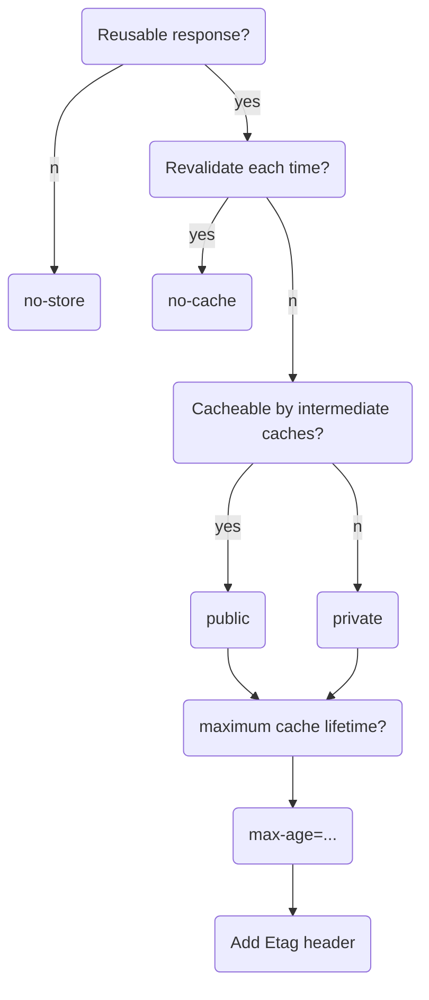

# HTTP缓存

* Memory Cache
* Service Worker Cache
* HTTP Cache
* Push Cache

## HTTP Cache

浏览器缓存过程： 强缓存，协商缓存。优先级较高的是强缓存，在命中强缓存失败的情况下，才会走协商缓存。

### 强缓存

强缓存是利用 http 头中的 Expires 和 Cache-Control 两个字段来控制的。强缓存中，当请求再次发出时，浏览器会根据其中的 expires 和 cache-control 判断目标资源是否“命中”强缓存，若命中则直接从缓存中获取资源，不会再与服务端发生通信。

**expires**

```
expires: Wed, 11 Sep 2019 16:12:18 GMT
```

expires 是一个时间戳，接下来如果图再次向服务器请求资源，浏览器就会先对比本地时间和 expires 的时间戳，如果本地时间小于 expires 设定的过期时间，那么就直接去缓存中取这个资源。由于时间戳是服务器来定义的，而本地时间的取值却来自客户端，因此 expires 的工作机制对客户端时间与服务器时间之间的一致性提出了极高的要求，若服务器与客户端存在时差，将带来意料之外的结果。

expires 允许通过绝对的时间戳来控制缓存过期时间，相应地，Cache-Control 中的max-age 字段也允许通过设定相对的时间长度来达到同样的目的。在 HTTP1.1 标准试图将缓存相关配置收敛进 Cache-Control 这样的大背景下， max-age可以视作是对 expires 能力的补位/替换。普遍会倾向于使用max-age。但如果应用对向下兼容有强诉求，那么 expires 仍然是不可缺少的。

**Cache-Control**

```
cache-control: max-age=31536000
```

> Cache-Control 的 max-age 配置项相对于 expires 的优先级更高。当 Cache-Control 与 expires 同时出现时，以 Cache-Control 为准。

* max-age & s-maxage

s-maxage 用于表示 cache 服务器上（比如 cache CDN）的缓存的有效时间的，并只对 public 缓存有效。

s-maxage 优先级高于 max-age，两者同时出现时，优先考虑 s-maxage。如果 s-maxage 未过期，则向代理服务器请求其缓存内容。

* public & private

public 与 private 是针对资源是否能够被代理服务缓存而存在的一组对立概念。

如果为资源设置了 public，那么它既可以被浏览器缓存，也可以被代理服务器缓存；如果设置了 private，则该资源只能被浏览器缓存。private 为默认值。(通常不用手动设置为public，当标记了max-age/s-maxage就已经显式的表明响应是可以被缓存的了)

* no-store & no-cache

no-cache 绕开了浏览器：为资源设置了 no-cache 后，每一次发起请求都不会再去询问浏览器的缓存情况，而是直接向服务端去确认该资源是否过期

no-store 比较绝情，顾名思义就是不使用任何缓存策略。在 no-cache 的基础上，它连服务端的缓存确认也绕开了，只允许你直接向服务端发送请求、并下载完整的响应。

### 协商缓存

协商缓存依赖于服务端与浏览器之间的通信。协商缓存机制下，浏览器需要向服务器去询问缓存的相关信息，进而判断是重新发起请求、下载完整的响应，还是从本地获取缓存的资源。

**Last-Modified/If-Modified-Since/if-Unmodified-Since**

Last-Modified 是一个时间戳，如果启用了协商缓存，它会在首次请求时随着 Response Headers 返回

```
Last-Modified: Fri, 27 Oct 2017 06:35:57 GMT
```

随后我们每次请求时，会带上一个叫 If-Modified-Since 的时间戳字段，它的值正是上一次 response 返回给它的 last-modified 值

```
If-Modified-Since: Fri, 27 Oct 2017 06:35:57 GMT
```

服务器接收到这个时间戳后，会比对该时间戳和资源在服务器上的最后修改时间是否一致，从而判断资源是否发生了变化。如果发生了变化，就会返回一个完整的响应内容，并在 Response Headers 中添加新的 Last-Modified 值；否则，返回如上图的 304 响应，Response Headers 不会再添加 Last-Modified 字段。

**Etag/If-None-Match**

Etag 是由服务器为每个资源生成的唯一的标识字符串，这个标识字符串是基于文件内容编码的，只要文件内容不同，它们对应的 Etag 就是不同的，反之亦然。因此 Etag 能够精准地感知文件的变化。

Etag 和 Last-Modified 类似，当首次请求时，我们会在响应头里获取到一个最初的标识符字符串

```
ETag: W/"2a3b-1602480f459"
```

那么下一次请求时，请求头里就会带上一个值相同的、名为 if-None-Match 的字符串供服务端比对了

```
If-None-Match: W/"2a3b-1602480f459"
```

Etag 的生成过程需要服务器额外付出开销，会影响服务端的性能，这是它的弊端。因此启用 Etag 需要我们审时度势。正如我们刚刚所提到的——Etag 并不能替代 Last-Modified，它只能作为 Last-Modified 的补充和强化存在。 Etag 在感知文件变化上比 Last-Modified 更加准确，优先级也更高。当 Etag 和 Last-Modified 同时存在时，以 Etag 为准。

**HTTP 缓存决策指南**



当资源内容不可复用时，直接为 Cache-Control 设置 no-store，拒绝一切形式的缓存；否则考虑是否每次都需要向服务器进行缓存有效确认，如果需要，那么设 Cache-Control 的值为 no-cache；否则考虑该资源是否可以被代理服务器缓存，根据其结果决定是设置为 private 还是 public；然后考虑该资源的过期时间，设置对应的 max-age 和 s-maxage 值；最后，配置协商缓存需要用到的 Etag、Last-Modified 等参数。

## Memory Cache

内存中的缓存，主要包含的是当前中页面中已经抓取到的资源，例如页面上已经下载的样式、脚本、图片等。读取内存中的数据肯定比磁盘快，内存缓存虽然读取高效，可是缓存持续性很短，会随着进程的释放而释放。一旦关闭 Tab 页面，内存中的缓存也就被释放了。

## Service Worker Cache

运行在浏览器背后的独立线程，脱离于浏览器窗体，因此无法直接访问 DOM，一般可以用来实现缓存功能。使用 Service Worker的话，传输协议必须为 HTTPS。因为 Service Worker 中涉及到请求拦截，所以必须使用 HTTPS 协议来保障安全。Service Worker 的缓存与浏览器其他内建的缓存机制不同，它可以让我们自由控制缓存哪些文件、如何匹配缓存、如何读取缓存，并且缓存是持续性的。

## Disk Cache

存储在硬盘中的缓存，读取速度慢点，但是什么都能存储到磁盘中，比之 Memory Cache 胜在容量和存储时效性上。

memory cache 要比 disk cache 快的多。举个例子：从远程 web 服务器直接提取访问文件可能需要500毫秒(半秒)，那么磁盘访问可能需要10-20毫秒，而内存访问只需要100纳秒，更高级的还有 L1缓存访问(最快和最小的 CPU 缓存)只需要0.5纳秒。

## Push Cache

Push Cache（推送缓存）是 HTTP/2 中的内容，当以上三种缓存都没有命中时，它才会被使用。它只在会话（Session）中存在，一旦会话结束就被释放，并且缓存时间也很短暂，在Chrome浏览器中只有5分钟左右，同时它也并非严格执行HTTP头中的缓存指令。

**刷新对于强缓存和协商缓存的影响**

1. 当ctrl+f5强制刷新网页时，直接从服务器加载，跳过强缓存和协商缓存。
2. 当f5刷新网页时，跳过强缓存，但是会检查协商缓存。
3. 浏览器地址栏中写入URL，回车 浏览器发现缓存中有这个文件了，不用继续请求了，直接去缓存拿。（最快）
